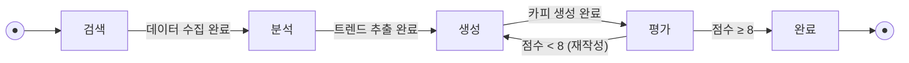
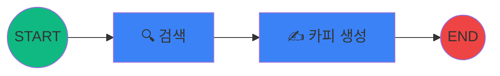
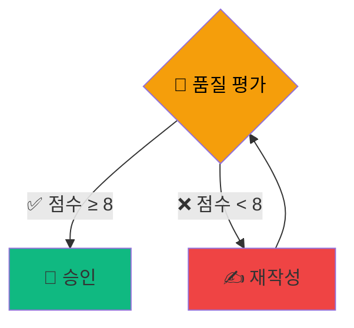
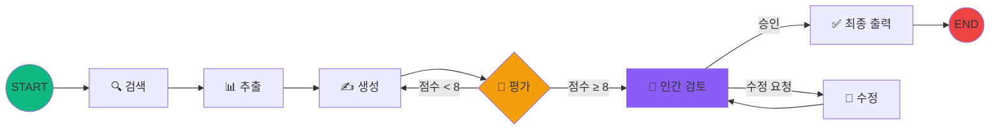

# 1교시
## LangGraph 이론 및 완벽한 환경 설정

⏱️ 90분

<!-- 1교시 시작. 기존 LangChain의 한계를 극복하고, 복잡한 마케팅 워크플로우를 상태 기반으로 제어하는 LangGraph의 핵심 원리를 깊이 있게 이해합니다. -->

---

# 학습 목표

<br>

### 이 시간이 끝나면 여러분은...

<br>

1. 🤖 **에이전틱 AI**가 왜 마케팅에 필요한지 설명할 수 있습니다
2. 🧩 LangGraph의 3대 핵심 개념 (**State / Node / Edge**)을 이해합니다
3. 🛠️ 실습에 필요한 모든 환경을 **완벽하게 구축**합니다

---
layout: section
---

# 1-1. AI 에이전트

생성형 AI를 넘어선 '에이전틱(Agentic) 워크플로우'

---

# 생성형 AI vs. 에이전틱 AI

<div class="grid grid-cols-2 gap-8 mt-4">
<div>

### 🔵 생성형 AI (지금까지)

- 사람이 프롬프트 입력
- AI가 **한 번** 응답 생성
- 결과가 마음에 안 들면? → **사람이 다시** 프롬프트

<br>

> "프롬프트 한 줄 → 결과 한 개"

</div>
<div>

### 🟣 에이전틱 AI (앞으로)

- AI가 **스스로 계획**을 세움
- 필요한 **도구를 직접** 사용
- 결과를 **자체 평가**하고 개선
- 기준에 도달할 때까지 **반복**

> "목표 하나 → AI가 알아서 완성"

</div>
</div>

<!-- 핵심 메시지: 프롬프트 한 줄로 끝나는 시대는 지났다. 이제는 워크플로우를 설계하는 시대다. -->

---

# LLM vs. Agent: 근본적인 차이

<div class="grid grid-cols-2 gap-8 mt-4">
<div>

### 🧠 LLM (대규모 언어 모델)

- **Stateless** (무상태)
- 입력 → 출력, 끝!
- 이전 호출을 **기억하지 못함**
- 매번 **같은 조건에서 시작**

```
[프롬프트] → 🧠 LLM → [응답]
              (기억 없음)
```

</div>
<div>

### 🤖 Agent (에이전트)

- **Stateful** (상태 보존)
- 현재 상태를 **기억하고 갱신**
- 상태에 따라 **다음 행동을 결정**
- **루프, 분기, 중단/재개** 가능

```
[State] → 🤖 Agent → [State']
          ↻ 반복     (기억 유지)
```

</div>
</div>

<br>

> 💡 LLM은 **뇌**, Agent는 뇌를 가진 **로봇**. 로봇은 현재 상황을 기억하고 판단합니다.

---

# Agent = 상태 기계 (State Machine)

에이전트는 본질적으로 **유한 상태 기계(FSM)** 입니다.



<div class="grid grid-cols-3 gap-4 text-center mt-2 text-sm">
<div class="p-2 rounded bg-blue-500 bg-opacity-10">

**상태(State)**<br>현재 어디에 있는가?

</div>
<div class="p-2 rounded bg-green-500 bg-opacity-10">

**전이(Transition)**<br>어떤 조건에서 이동하는가?

</div>
<div class="p-2 rounded bg-purple-500 bg-opacity-10">

**행동(Action)**<br>각 상태에서 무엇을 하는가?

</div>
</div>

---

# 왜 예측 가능성이 중요한가?

<div class="grid grid-cols-2 gap-8 mt-4">
<div>

### ❌ 순수 LLM 접근

- "알아서 잘 해줘" → **결과를 예측 불가**
- 할루시네이션, 논리 점프
- 실패 시 **원인 파악 어려움**
- 프로덕션 적용? 🙅

```
입력 → ??? → 출력
     (블랙박스)
```

</div>
<div>

### ✅ 상태 기계 접근 (LangGraph)

- **각 단계가 명확하게 정의**됨
- "지금 어디에 있고, 다음에 무엇을 할지" 투명
- 실패 시 **어느 단계에서 문제인지** 즉시 파악
- 프로덕션 적용 ✅

```
입력 → [검색] → [분석] → [생성] → 출력
       (모든 단계가 투명)
```

</div>
</div>

<br>

<div class="p-3 rounded bg-gradient-to-r from-blue-500/10 to-purple-500/10 text-center">

### 💡 핵심 메시지

**LangGraph** = LLM의 창의성은 활용하되, **워크플로우는 예측 가능하게** 만드는 프레임워크

</div>

---

# 에이전트의 4가지 핵심 능력

<div class="grid grid-cols-2 gap-6 mt-6">
<div class="p-4 rounded-lg bg-blue-500 bg-opacity-10">

### 🎯 계획 (Planning)
목표를 달성하기 위한<br>단계별 전략 수립

</div>
<div class="p-4 rounded-lg bg-green-500 bg-opacity-10">

### 🔧 도구 사용 (Tool Use)
웹 검색, 데이터 수집 등<br>외부 도구를 직접 호출

</div>
<div class="p-4 rounded-lg bg-purple-500 bg-opacity-10">

### 🪞 자기 반성 (Reflection)
결과를 평가하고<br>스스로 개선 방향 도출

</div>
<div class="p-4 rounded-lg bg-orange-500 bg-opacity-10">

### 🤝 다중 협업 (Multi-Agent)
전문 에이전트끼리<br>역할 분담 및 협업

</div>
</div>

<div class="mt-4 p-3 rounded bg-blue-500 bg-opacity-10 text-sm">

💡 오늘 워크숍에서는 **1~3번(계획, 도구, 반성)** 을 직접 구현합니다. Multi-Agent는 심화 과정에서!

</div>

---

# 에이전트의 도구 연동 방식 비교

에이전트가 외부 세계와 소통하는 **세 가지 주요 방식**

| | **MCP** | **ACP** | **CLI** |
|------|---------|---------|---------|
| **정식 명칭** | Model Context Protocol | Agent Communication Protocol | Command Line Interface |
| **주도** | Anthropic | Google / IBM | — (전통적 방식) |
| **목적** | LLM ↔ 도구/데이터 연결 | 에이전트 ↔ 에이전트 통신 | 사람/스크립트 → 프로그램 실행 |
| **통신 방향** | 모델이 서버에 요청 | 에이전트 간 양방향 | 단방향 (명령 → 결과) |
| **상태 관리** | 서버가 컨텍스트 유지 | 프로토콜 레벨 상태 공유 | 없음 (Stateless) |
| **사용 예시** | DB 조회, 파일 읽기, API 호출 | 멀티 에이전트 협업 | `python script.py --arg` |

<br>

> 💡 오늘 실습의 **Tavily 검색**은 Tool 호출 방식이며, MCP 서버로도 제공됩니다

---

# 왜 마케터에게 AI 에이전트가 필요한가?

<div class="mt-4">

### 🔄 퍼포먼스 마케팅의 반복 업무

</div>

| 업무 | As-Is (수동) | To-Be (에이전트) |
|------|-------------|-----------------|
| 소재 기획 | 트렌드 수동 리서치 → 브레인스토밍 | **자동 트렌드 수집 → 카피 생성** |
| 키워드 리서치 | 검색 광고 툴 수동 조회 | **자동 경쟁 분석 → 키워드 추천** |
| A/B 테스트 | 수동 변형 제작 | **자동 변형 생성 → 성과 예측** |
| 리포팅 | 대시보드 스크린샷 + 요약 작성 | **자동 데이터 수집 → 인사이트 도출** |

<br>

> 💡 **AX(AI Transformation)** = 단순 도구 활용을 넘어,<br>
> 업무 프로세스 자체를 AI 중심으로 **재설계**하는 것

<!-- AX의 핵심은 "AI를 쓴다"가 아니라 "AI 중심으로 프로세스를 재설계한다"는 것. -->

---
layout: section
---

# 1-2. LangGraph 핵심 아키텍처 딥다이브

왜 LangGraph인가? 3대 핵심 개념 완전 정복

---

# LangChain vs. LangGraph

LangGraph는 LangChain 위에 만들어진 **그래프 오케스트레이션 레이어**입니다.

<div class="grid grid-cols-2 gap-8 mt-4">
<div>

### LangChain의 한계 ⚠️

- **선형적(Sequential)** 체인 구조
- 조건부 분기, 루프 처리 어려움
- 복잡한 워크플로우 **상태 관리 부재**
- "중간에 사람이 개입" 시나리오 불가

```
A → B → C → D (일직선)
```

</div>
<div>

### LangGraph의 해결책 ✅

- **순환 가능 그래프** 구조
- 조건부 분기 + 루프 자유자재
- **명시적 상태 관리** + 체크포인팅
- **Human-in-the-loop** 네이티브 지원

```
A → B → C ↔ D (분기+루프)
         ↕
    E → F (병렬)
```

</div>
</div>

<!-- 오늘 실습에서 이 차이를 직접 체감하게 됩니다. -->

---

# 핵심 개념 ① State (상태)

그래프 전체의 **공유 데이터 구조** — 그래프의 "기억"

<div class="grid grid-cols-2 gap-6 mt-4">
<div>

```python
from typing import TypedDict

class MarketingState(TypedDict):
    target_audience: str    # 타겟 오디언스
    trend_keywords: list    # 트렌드 키워드
    ad_copy: str           # 생성된 광고 카피
    quality_score: int     # 품질 평가 점수
    approval_status: str   # 승인 상태
```

</div>
<div>

### 핵심 포인트

- `TypedDict`로 타입 명시
- 모든 노드가 **동일한 State를 읽고 씀**
- 각 노드는 필요한 부분만 업데이트
- State = 그래프의 **중앙 저장소**

</div>
</div>

---

# 핵심 개념 ② Node (노드)

그래프의 각 **작업 단위** — Python 함수 또는 LLM 호출

<div class="grid grid-cols-2 gap-6 mt-4">
<div>

```python
def copywriter_node(state: MarketingState) -> dict:
    """
    입력: 현재 State 전체
    출력: State 업데이트 (부분 딕셔너리)
    """
    # LLM에게 카피 생성 요청
    response = llm.invoke(
        f"타겟: {state['target_audience']}"
    )
    
    # 업데이트할 필드만 반환!
    return {"ad_copy": response.content}
```

</div>
<div>

### 핵심 포인트

- **입력**: 전체 State 객체
- **출력**: 업데이트할 필드만 dict로 반환
- 반환하지 않은 필드 → 기존 값 유지
- 특수 노드: `START`(진입점), `END`(종료점) — 자동 제공

<br>

### 마케팅 예시

- `search_trends_node`
- `trend_copywriter_node`
- `quality_evaluator_node`

</div>
</div>

---

# 핵심 개념 ③-A: 일반 엣지 (Normal Edge)

노드 간 **무조건 실행**되는 순차적 연결

### 코드

```python
# A 다음에 항상 B 실행
graph.add_edge("search", "copywriter")
```

- `search` 완료 후 **항상** `copywriter` 실행 · 분기 없이 **직선 흐름**

<br>

### 다이어그램



> 💡 2교시에서 만드는 그래프가 바로 이 구조!

---

# 핵심 개념 ③-B: 조건부 엣지 (Conditional Edge)

State 값에 따라 **다음 노드를 동적으로 결정**

<div class="grid grid-cols-2 gap-6 mt-4">
<div>

### 코드

```python
# State 값에 따라 분기
graph.add_conditional_edges(
    "evaluator",
    should_retry,  # 라우팅 함수
    {
        "pass": "human_review",
        "retry": "copywriter"
    }
)
```

</div>
<div>

### 다이어그램



</div>
</div>

> 💡 조건부 엣지가 만들어내는 **"자율 개선 루프"** 가 LangGraph의 가장 강력한 무기!

---

# 오늘 만들 그래프: 전체 아키텍처



<div class="mt-2 text-center text-sm opacity-70">

2교시: 단순 버전 → 3교시: Tool + 루프 → 4교시: Human-in-the-loop 추가

</div>

---
layout: section
---

# 1-3. 실습 환경 및 API 세팅

Python 환경 구축부터 API 연결까지

---

# Python 설치

<div class="mt-4">

### 🐍 Python 3.14 설치

1. https://www.python.org/downloads/ 접속
2. **"Download Python 3.14.x"** 클릭
3. 설치 시 **"Add Python to PATH"** ✅ 체크


</div>

---

# VS Code 설치

<div class="mt-4">

### 📝 Visual Studio Code

1. https://code.visualstudio.com/ 접속
2. 본인 OS에 맞는 버전 다운로드
3. 설치 후 실행

</div>

---

# 프로젝트 생성

<div class="grid grid-cols-2 gap-8 mt-4">
<div>

### 📁 프로젝트 폴더 만들기

1. VS Code에서 **File → Open Folder**
2. 원하는 위치에 **`langgraph-marketing`** 폴더 생성
3. 해당 폴더 열기

</div>
<div>


</div>
</div>

---

# uv 소개: 초고속 Python 패키지 매니저

<div class="grid grid-cols-2 gap-8 mt-4">
<div>

### 🤔 pip의 불편함

- 패키지 설치가 **느림**
- 가상환경 생성이 **번거로움**
- 의존성 충돌 해결이 **불안정**

</div>
<div>

### ⚡ uv는?

- Rust로 만든 **초고속** 패키지 매니저
- pip 대비 **10~100배 빠름**
- 가상환경 생성 + 패키지 설치 **한 번에**
- Python 자체 설치도 가능!

</div>
</div>

<br>

> 💡 **uv** = pip + venv + pyenv를 모두 대체하는 **올인원 도구**

---

# uv 설치 및 가상환경 설정

### 1. uv 설치

```bash
# Mac/Linux
curl -LsSf https://astral.sh/uv/install.sh | sh

# Windows (PowerShell)
powershell -ExecutionPolicy ByPass -c "irm https://astral.sh/uv/install.ps1 | iex"
```

### 2. 가상환경 생성

VS Code 터미널에서:

```bash
# Python 3.14로 프로젝트 초기화 (가상환경 자동 생성!)
uv init --python 3.14
```

<div class="mt-4 p-3 rounded bg-green-500 bg-opacity-10 text-sm">

✅ `uv init`만으로 **Python 설치 + 가상환경 생성**이 한 번에 완료됩니다!

</div>

---

# 프로젝트 구조

모든 교시의 실습은 **Jupyter 노트북**으로 진행합니다.

```
langgraph-marketing/
├── .venv/              ← 가상환경 (전 교시 공유)
├── .env                ← API 키 (GOOGLE_API_KEY, TAVILY_API_KEY)
├── pyproject.toml      ← uv 프로젝트 설정
├── session1.ipynb      ← 1교시: 환경 테스트
├── session2.ipynb      ← 2교시: 단일 노드 카피 생성기
├── session3.ipynb      ← 3교시: Tool + 자체 평가 루프
└── session4.ipynb      ← 4교시: Human-in-the-loop
```

<div class="mt-4 p-3 rounded bg-blue-500 bg-opacity-10 text-sm">

💡 실습 시작: VS Code에서 `.ipynb` 파일을 열면 바로 노트북 실행 가능!

</div>

---

# 필수 라이브러리 설치

```bash
# LangGraph + LangChain 핵심
uv add langgraph langchain langchain-google-genai

# 외부 도구 (3교시에서 사용)
uv add tavily-python

# 유틸리티
uv add python-dotenv
```

### ✅ 설치 확인

```python
# uv run으로 가상환경 내에서 실행
uv run python -c "
import langgraph, langchain
print(f'LangGraph 버전: {langgraph.__version__}')
print(f'LangChain 버전: {langchain.__version__}')
print('✅ 모든 라이브러리 설치 완료!')
"
```

---

# Jupyter 노트북 세팅

<div class="grid grid-cols-2 gap-8 mt-4">
<div>

### 📓 노트북이란?

코드를 **셀 단위**로 실행하고 결과를 **바로 확인**

- 코드 실행 → `Shift + Enter`
- 결과가 셀 아래에 바로 출력
- **그래프 시각화**도 인라인으로 확인
- 실습 내용이 자동 저장

</div>
<div>

### ⚙️ VS Code에서 사용하기

1. VS Code에서 프로젝트 폴더 열기
2. `session1.ipynb` 파일 생성
3. 커널 선택 → **.venv (Python 3.14)** 선택
4. 코드 셀 작성 후 `Shift + Enter`

</div>
</div>


---

# `.env` 파일 설정

<div class="grid grid-cols-2 gap-6">
<div>

### 📁 `.env` 파일 생성

프로젝트 루트에 `.env` 파일을 만듭니다.

```bash
# .env 파일
GOOGLE_API_KEY=강사가_제공하는_키
```

<br>

<div class="p-3 rounded bg-red-500 bg-opacity-10 text-sm">

🔒 API 키는 **절대 외부에 공유하지 마세요**

</div>

</div>
<div>

### ✅ 로드 확인

```python
from dotenv import load_dotenv
import os

load_dotenv()
print("API Key:", 
      os.getenv("GOOGLE_API_KEY")[:10] + "...")
print("✅ API 키 로드 성공!")
```

</div>
</div>

---

# API 연결 테스트 🧪

노트북 `code/session1.ipynb`에서 새 셀을 만들고 아래 코드를 실행하세요.

```python
from dotenv import load_dotenv
from langchain_google_genai import ChatGoogleGenerativeAI
load_dotenv()
# Gemini 모델 초기화
llm = ChatGoogleGenerativeAI(model="gemini-2.5-flash")
# 테스트 호출
response = llm.invoke("안녕하세요! LangGraph 실습을 위한 테스트입니다.")
print(response.content)
print("✅ Google Gemini API 연결 성공!")
```

<!-- 환경 설정에서 문제가 발생한 분은 바로 손들어주세요. 이후 실습의 기반이 됩니다. -->

---

# 🎉 환경 설정 완료 체크리스트

<br>

모든 항목에 ✅가 되었는지 확인하세요!

<br>

- [ ] Python 3.14 설치 및 `python --version` 확인
- [ ] VS Code + **Python / Jupyter 확장** 설치
- [ ] `uv` 설치 및 `uv init --python 3.14` 실행
- [ ] `uv add langgraph langchain langchain-google-genai tavily-python python-dotenv`
- [ ] `.env` 파일 생성 및 **GOOGLE_API_KEY** 등록
- [ ] VS Code에서 노트북 실행 확인
- [ ] **Gemini API 호출 성공** (위 코드 실행)

<br>

> 📌 Tavily API 키는 **3교시에서 발급** 예정

---
layout: center
---

# ☕ 쉬는 시간 (10분)

**다음 시간**: 첫 번째 LangGraph 에이전트를 직접 만들어봅니다!
