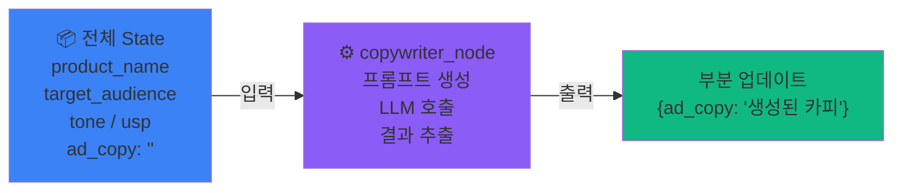
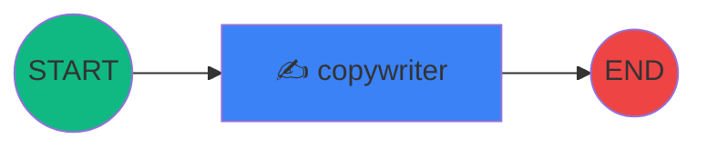

# 2교시
## 단일 노드 에이전트: 타겟 맞춤형 카피 생성기

⏱️ 40분 · ⭐⭐ 간단한 실습

<!-- 2교시 시작. LangGraph의 가장 기본적인 구조를 코드로 직접 구현합니다. -->

---

# 학습 목표

<br>

### 이 시간이 끝나면 여러분은...

<br>

1. 📦 **Graph State**를 `TypedDict`로 설계할 수 있습니다
2. 🧩 **Node 함수**의 입출력 규칙을 이해합니다
3. 🔗 **StateGraph**를 조립·컴파일·실행할 수 있습니다
4. ✍️ 타겟에 맞춤화된 **광고 카피 3개**를 자동 생성합니다

---
layout: section
---

# 2-1. Graph State 정의

그래프에 어떤 데이터가 흘러야 하는가?

---

# State 설계하기

<div class="grid grid-cols-2 gap-6 mt-4">
<div>

### 마케팅 카피 생성에 필요한 정보

**입력** (마케터가 제공)
- 제품/서비스명
- 타겟 오디언스
- 톤앤매너
- 핵심 USP (차별점)

**출력** (AI가 생성)
- 광고 카피

</div>
<div>

### CopywriterState 정의

```python {1|3-8|all}
from typing import TypedDict

class CopywriterState(TypedDict):
    product_name: str      # 제품/서비스명
    target_audience: str   # 타겟 오디언스
    tone: str              # 톤앤매너
    usp: str               # 핵심 차별점
    ad_copy: str           # 생성된 광고 카피
```

> 💡 `ad_copy`는 아직 생성 전이므로, 실행 시 **빈 문자열(`""`)로 초기화**합니다.

</div>
</div>

---

# TypedDict는 왜 쓰는 건가요?

<div class="grid grid-cols-2 gap-8 mt-6">
<div>

### ❌ 일반 `dict`

```python
state = {
    "product_name": "...",
    "target_audiance": "...",  # 오타!
    "tone": 123,               # 타입 오류!
}
```

- 오타를 잡아주지 않음
- 어떤 키가 있는지 모름
- IDE 자동완성 불가

</div>
<div>

### ✅ `TypedDict`

```python
class CopywriterState(TypedDict):
    product_name: str
    target_audience: str
    tone: str
```

- **타입 힌트**로 안정성 확보
- IDE **자동완성** 지원
- LangGraph 내부에서 **State 검증**

</div>
</div>

<br>

> 💡 State = 그래프의 **"공유 메모리"**: 모든 노드가 동일한 State를 읽고, 필요한 부분만 업데이트

---
layout: section
---

# 2-2. 카피라이터 노드(Node) 구현

LLM으로 광고 카피를 생성하는 노드 만들기

---

# 카피라이터 노드 작성

노트북 `code/session2.ipynb`의 **첫 셀**에 아래 코드를 넣으세요.

```python
# 첫 셀: import + 초기화
from dotenv import load_dotenv
from typing import TypedDict
from langchain_google_genai import ChatGoogleGenerativeAI
from langgraph.graph import StateGraph, START, END

load_dotenv()
llm = ChatGoogleGenerativeAI(model="gemini-2.5-flash")
```

다음 셀부터 아래 코드를 이어서 작성합니다.

---

# 🤖 LLM 모델 선택 가이드

LangGraph에서는 **노드마다 다른 모델**을 배치할 수 있습니다.

<div class="grid grid-cols-2 gap-8 mt-4">
<div>

### 📊 Small vs Large 모델 비교

단순·반복 작업은 Small, 정확도·품질이 중요한 작업은 Large 모델을 사용합니다.

| 역할 | 모델 |
|------|------|
| 라우팅/분류 | **Small** |
| 데이터 추출/파싱 | **Small** |
| 가드레일/검증 | **Small** |
| Tool Calling | **Large** |
| 복잡한 추론/분석 | **Large** |
| 최종 응답 생성 | **Large** |

</div>
<div>

### ⚡ 멀티 모델 설정 예시

```python
from langchain_google_genai import (
    ChatGoogleGenerativeAI,
)

# 라우팅/검증 → Small 모델 (빠르고 저렴)
small_llm = ChatGoogleGenerativeAI(
    model="gemini-2.5-flash"
)

# 핵심 추론/생성 → Large 모델 (정확도 중요)
large_llm = ChatGoogleGenerativeAI(
    model="gemini-2.5-pro"
)
```

</div>
</div>

> 💡 **핵심 원칙**: 하나의 모델로 통일하지 말고, **노드의 복잡도와 호출 빈도**에 따라 적절한 모델을 배치하는 것이 비용 대비 성능을 극대화하는 방법!

---

```python {1-3|5-20|22-23|all}
from langchain_google_genai import ChatGoogleGenerativeAI

llm = ChatGoogleGenerativeAI(model="gemini-2.5-flash")

def copywriter_node(state: CopywriterState) -> dict:
    prompt = f"""
    당신은 퍼포먼스 마케팅 전문 카피라이터입니다.
    
    아래 정보를 바탕으로 클릭률(CTR)을 극대화할 수 있는 
    광고 카피 3개를 작성해주세요.
    
    [제품/서비스] {state['product_name']}
    [타겟 오디언스] {state['target_audience']}
    [톤앤매너] {state['tone']}
    [핵심 USP] {state['usp']}
    
    각 카피는 다음을 포함해야 합니다:
    1. 헤드라인 (15자 이내)
    2. 서브 카피 (30자 이내)
    3. CTA 버튼 텍스트
    
    광고 플랫폼: Meta(Instagram/Facebook) 피드 광고
    """
    
    response = llm.invoke(prompt)
    return {"ad_copy": response.content}  # ← State 부분 업데이트!
```

---

# 노드 함수의 입출력 규칙



<br>

### 핵심 규칙 3가지

1. **입력**: 전체 State 객체를 받음 → `state: CopywriterState`
2. **출력**: 업데이트할 필드**만** 딕셔너리로 반환 → `{"ad_copy": "..."}`
3. **유지**: 반환하지 않은 필드는 기존 값이 **그대로 유지**됨

---
layout: section
---

# 2-3. 그래프 연결 및 실행

State + Node + Edge = 완성된 그래프!

---

# StateGraph 조립 및 컴파일

```python {1|3-4|6-7|9-11|13-14|all}
from langgraph.graph import StateGraph, START, END

# 1. 그래프 생성 (State 타입 지정)
graph_builder = StateGraph(CopywriterState)

# 2. 노드 추가
graph_builder.add_node("copywriter", copywriter_node)

# 3. 엣지 연결
graph_builder.add_edge(START, "copywriter")
graph_builder.add_edge("copywriter", END)

# 4. 컴파일! (빌더 → 실행 가능한 그래프 객체로 변환)
graph = graph_builder.compile()
```

<br>



---

# 그래프 시각화 🔍

노트북에서 그래프 구조를 **이미지로 확인**할 수 있습니다.

```python
from IPython.display import Image, display

# 그래프 구조를 이미지로 시각화
display(Image(graph.get_graph().draw_mermaid_png()))
```

<br>

<div class="p-3 rounded bg-blue-500 bg-opacity-10 text-sm">

💡 `draw_mermaid_png()`는 그래프의 **노드와 엣지 구조**를 다이어그램으로 보여줍니다.<br>
코드를 변경할 때마다 실행하면 구조 변화를 바로 확인할 수 있습니다!

</div>

---

# 그래프 실행 🚀

```python
result = graph.invoke(CopywriterState(
    product_name="글로우핏 콜라겐 젤리",
    target_audience="25-35세 여성, 피부 관리에 관심이 높고 간편한 이너뷰티 제품 선호",
    tone="트렌디하고 감각적인, MZ세대 감성",
    usp="하루 1포로 콜라겐 5,000mg 섭취, 맛있는 복숭아 맛",
    ad_copy=""
))

print("=" * 50)
print("🎯 생성된 광고 카피")
print("=" * 50)
print(result["ad_copy"])
```

<div class="p-3 rounded bg-green-500 bg-opacity-10 text-sm">

✅ 성공하면 **헤드라인 + 서브카피 + CTA** 형식의 광고 카피 3개가 출력됩니다!

</div>

---

<div class="p-3 rounded bg-blue-500 bg-opacity-10">

### 🏋️ 실습 과제

**여러분이 담당하는 제품/서비스**로 입력값을 변경하여 다시 실행해보세요!

</div>

---

# 🎉 첫 번째 LangGraph 에이전트 완성!

<div class="mt-8">

### 지금까지 배운 것

| 개념 | 역할 | 코드 |
|------|------|------|
| **State** | 데이터 구조 정의 | `TypedDict` |
| **Node** | 작업 수행 (LLM 호출) | `def node(state) -> dict` |
| **Edge** | 노드 간 연결 | `add_edge(A, B)` |
| **Graph** | 전체 조립 + 실행 | `compile()` → `invoke()` |

</div>

<br>

<div class="text-center">

### 다음 시간 미리보기 👀

단순 프롬프트 → **실시간 트렌드 데이터를 수집**하여 카피에 반영!<br>
그리고 **자체 평가 루프**까지!

</div>

---
layout: center
---

# ☕ 쉬는 시간 (10분)

**다음 시간**: 에이전트에 **검색 도구**를 장착합니다!
