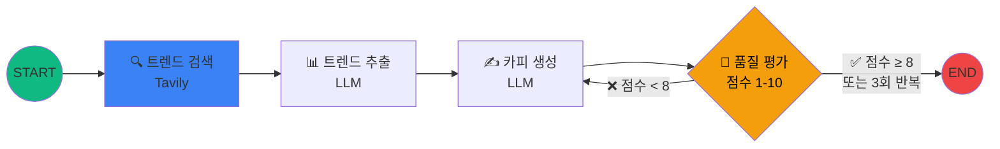

# 3교시
## Tool 연동 에이전트: 검색 기반 트렌드 카피 기획

⏱️ 55분 · ⭐⭐⭐ 중간 난이도

<!-- 3교시 시작. 에이전트에 검색 도구를 장착하고, 조건부 엣지로 자체 평가 루프를 만듭니다. -->

---

# 학습 목표

<br>

### 이 시간이 끝나면 여러분은...

<br>

1. 🔍 **Tavily** 검색 도구를 에이전트에 연동할 수 있습니다
2. 🔀 **Conditional Edge**로 조건 분기 로직을 구현할 수 있습니다
3. 🔄 품질 기준 미달 시 **자동 재작성 루프**를 만들 수 있습니다
4. 📊 2교시 대비 **트렌드 데이터가 반영된** 고품질 카피를 생성합니다

---

# Tavily: AI 에이전트 전용 검색 엔진

<div class="grid grid-cols-2 gap-8 mt-4">
<div>

### 🔍 일반 검색 API와 뭐가 다른가?

- 일반 검색: URL + 제목만 반환
- **Tavily**: 검색 결과를 **AI가 바로 활용할 수 있는 형태**로 반환
- 웹페이지 본문 **요약을 포함**
- `search_depth="advanced"`로 심층 검색

</div>
<div>

### ⚡ 핵심 특징

- **AI 에이전트에 최적화**된 검색 결과
- LLM이 바로 소화할 수 있는 **구조화된 컨텍스트**
- 한 번의 호출로 **여러 소스 종합 요약**

<div class="mt-4 p-3 rounded bg-green-500 bg-opacity-10 text-sm">

✅ 무료: **월 1,000회** · 💳 신용카드 **불필요**

</div>

</div>
</div>

---

# 🔑 Tavily API 키 발급 (5분)

### 📝 발급 순서

1. https://tavily.com/ 접속
2. **"Get Started"** → 이메일 또는 Google 가입
3. Dashboard → **API Key 복사** 📋
4. `.env` 파일에 추가:

```bash
# .env 파일에 한 줄 추가
TAVILY_API_KEY=발급받은_키_붙여넣기
```

<br>

<div class="p-3 rounded bg-blue-500 bg-opacity-10 text-sm">

💡 발급 후 터미널에서 확인: `echo $TAVILY_API_KEY` 또는 노트북에서 `os.getenv("TAVILY_API_KEY")` 실행

</div>

---

# 왜 State를 확장해야 할까?

<div class="grid grid-cols-2 gap-8 mt-4">
<div>

### 2교시의 한계 🤔

- LLM의 **학습 데이터에만** 의존
- 작년 트렌드가 올해 카피에? 😅
- "이 카피 괜찮은가?" → **평가 기준 없음**
- 결과가 나쁘면? → 사람이 **다시 실행**

</div>
<div>

### 3교시에서 해결하는 것 ✅

- 🔍 **실시간 트렌드** → `search_results`
- 📊 **키워드 추출** → `trend_keywords`
- 🎯 **자체 평가** → `quality_score`, `feedback`
- 🔄 **자동 재시도** → `iteration_count`

> 💡 **새로운 기능 = 새로운 State 필드**

</div>
</div>

---

#

---
layout: section
---

# 3-1. State 설계 및 Tool 연동

검색 도구를 에이전트에 장착하기

---

# 확장된 State 설계

노트북 `code/session3.ipynb`의 **첫 셀**에 아래 코드를 넣으세요.

```python
# 첫 셀: import + 초기화
from dotenv import load_dotenv
from typing import TypedDict
from langchain_google_genai import ChatGoogleGenerativeAI
from langgraph.graph import StateGraph, START, END
from tavily import TavilyClient
import os

load_dotenv()
llm = ChatGoogleGenerativeAI(model="gemini-2.5-flash")
tavily_client = TavilyClient(api_key=os.getenv("TAVILY_API_KEY"))
```

---

# 확장된 State 설계

```python
class TrendCopyState(TypedDict):
    # 기존 (2교시와 동일)
    product_name: str
    target_audience: str
    tone: str
    usp: str
    ad_copy: str

    # 🆕 3교시에서 추가
    search_query: str              # 검색 쿼리
    search_results: list[str]      # 검색 결과 요약
    trend_keywords: list[str]      # 추출된 트렌드 키워드
    quality_score: int             # 품질 자체 평가 점수 (1-10)
    feedback: str                  # 평가 피드백
    iteration_count: int           # 반복 횟수
```

<br>

> 💡 `quality_score` → 조건부 분기의 기준 / `iteration_count` → 무한 루프 방지<br>
> 💡 TypedDict는 **상속 가능** — 4교시에서 `TrendCopyState`를 확장합니다

---

# Tavily 검색 노드 🔍 (1/2)

```python
from tavily import TavilyClient
import os

tavily_client = TavilyClient(api_key=os.getenv("TAVILY_API_KEY"))

def search_trends_node(state: TrendCopyState) -> dict:
    # 검색 쿼리 자동 생성
    query = (
        f"{state['product_name']} {state['target_audience']} "
        f"최신 트렌드 마케팅"
    )
```

---

# Tavily 검색 노드 🔍 (2/2)

```python
    # Tavily AI 검색 실행
    results = tavily_client.search(
        query=query,
        max_results=5,
        search_depth="advanced"  # 심층 검색 모드
    )
    
    summaries = [r["content"] for r in results["results"]]
    
    print(f"🔍 검색 완료: {len(summaries)}건의 결과")
    
    return {
        "search_query": query,
        "search_results": summaries
    }
```

<div class="p-3 rounded bg-blue-500 bg-opacity-10 text-sm">

💡 `search_depth="advanced"` → Tavily가 각 검색 결과의 **본문 내용까지 요약**해서 반환합니다.

</div>

---
layout: section
---

# 3-2. 트렌드 반영 카피 생성

노드 분리 및 프롬프트 엔지니어링

---

# 트렌드 키워드 추출 노드 📊

```python
def extract_trends_node(state: TrendCopyState) -> dict:
    prompt = f"""
    아래 검색 결과를 분석하여,
    '{state['product_name']}' 마케팅에 활용할 수 있는 
    최신 트렌드 키워드 5개를 추출해주세요.
    
    [검색 결과]
    {chr(10).join(state['search_results'][:5])}
    
    각 키워드에 대해 간단한 활용 근거도 함께 제시해주세요.
    
    출력 형식:
    1. [키워드] - [활용 근거]
    2. ...
    """
    
    response = llm.invoke(prompt)
    keywords = response.content.split("\n")
    return {"trend_keywords": keywords}
```

<div class="mt-2 p-3 rounded bg-yellow-500 bg-opacity-10 text-sm">

⚠️ `split("\n")`은 간단한 파싱입니다. 실무에서는 **구조화된 출력(JSON)** 을 요구하는 것이 더 안정적입니다.

</div>

---

# 트렌드 반영 카피 생성 노드 ✍️ (1/2)

```python
def trend_copywriter_node(state: TrendCopyState) -> dict:
    prompt = f"""
    당신은 데이터 기반 퍼포먼스 마케팅 카피라이터입니다.
    아래의 실시간 트렌드 분석 결과를 반영하여 
    전환율(CVR)을 극대화할 광고 카피 3개를 작성해주세요.
    
    [제품/서비스] {state['product_name']}
    [타겟 오디언스] {state['target_audience']}
    [톤앤매너] {state['tone']}
    [핵심 USP] {state['usp']}
    
    [📊 실시간 트렌드 키워드]
    {chr(10).join(state['trend_keywords'])}
    """
```

> 💡 2교시와 달리 **실시간 트렌드 데이터**가 프롬프트에 주입됩니다!

---

# 트렌드 반영 카피 생성 노드 ✍️ (2/2)

```python
    # 프롬프트 이어서 (출력 형식 지정)
    prompt += f"""
    [📊 검색 결과 컨텍스트]
    {chr(10).join(state['search_results'][:3])}
    
    출력 형식 (카피 3개):
    ---
    [카피 #N]
    헤드라인: (15자 이내)
    서브카피: (30자 이내)  
    CTA: (버튼 텍스트)
    반영 트렌드: (어떤 트렌드를 왜 적용했는지)
    ---
    """
    response = llm.invoke(prompt)
    return {"ad_copy": response.content}
```

---
layout: section
---

# 3-3. 자체 평가 및 재검색 루프

Conditional Edge로 "자율 개선 루프" 만들기

---

# 품질 평가 노드 🎯 (1/2) — 프롬프트

```python
def quality_evaluator_node(state: TrendCopyState) -> dict:
    prompt = f"""
    아래 광고 카피의 품질을 1-10점으로 평가해주세요.
    
    [광고 카피]
    {state['ad_copy']}
    
    평가 기준:
    1. 타겟 적합성 (타겟 오디언스의 관심사/니즈 반영)
    2. 트렌드 반영도 (최신 트렌드가 자연스럽게 녹아있는지)
    3. 클릭 유도력 (CTR을 높일 수 있는 후킹 요소)
    4. 메시지 명확성 (USP가 명확히 전달되는지)
    
    출력 형식:
    점수: [숫자만]
    피드백: [구체적인 개선 방향]
    """
```

---

# 품질 평가 노드 🎯 (2/2) — 파싱 & 반환

```python
    # 이어서
    response = llm.invoke(prompt)
    
    try:
        score = int(''.join(filter(str.isdigit, 
                    response.content.split('\n')[0]))[:2])
        score = min(score, 10)
    except (ValueError, IndexError):
        print("⚠️ 점수 파싱 실패, 기본값 5점 적용")
        score = 5  # LLM이 "점수: 8.5" 같은 예상 외 형식으로 답할 수 있음
    
    return {
        "quality_score": score,
        "feedback": response.content,
        "iteration_count": state.get("iteration_count", 0) + 1
    }
```

> 💡 4교시에서 `with_structured_output()`을 적용하면 이 파싱 코드가 **전부 사라집니다!**

---

# Conditional Edge: 분기 로직

```python
def should_retry(state: TrendCopyState) -> str:
    """품질 점수에 따라 재작성 또는 완료를 결정"""
    
    if state["quality_score"] >= 8:
        print(f"✅ 품질 통과! (점수: {state['quality_score']})")
        return "pass"
    
    elif state["iteration_count"] >= 3:
        print(f"⚠️ 최대 반복 도달 (점수: {state['quality_score']})")
        return "pass"  # 무한 루프 방지
    
    else:
        print(f"🔄 재작성 필요 (점수: {state['quality_score']}, "
              f"반복: {state['iteration_count']})")
        return "retry"
```

<br>

<div class="grid grid-cols-3 gap-4 text-center text-sm">
<div class="p-3 rounded bg-green-500 bg-opacity-15">

**점수 ≥ 8**<br>→ `"pass"` → END

</div>
<div class="p-3 rounded bg-yellow-500 bg-opacity-15">

**반복 ≥ 3회**<br>→ `"pass"` → END (안전장치)

</div>
<div class="p-3 rounded bg-red-500 bg-opacity-15">

**그 외**<br>→ `"retry"` → 재작성

</div>
</div>

---

# 완성된 그래프 아키텍처



<div class="mt-4 text-center">

> 💡 **핵심**: Conditional Edge가 만드는 **"자율 개선 루프"**<br>
> 에이전트가 스스로 품질을 판단하고, 기준 미달이면 자동으로 재작성합니다

</div>

<div class="mt-2 p-3 rounded bg-blue-500 bg-opacity-10 text-sm">

📐 **코드 ↔ 다이어그램 매핑**: `add_edge(START, "search_trends")` → START → 🔍 / `add_conditional_edges("quality_evaluator", ...)` → 🎯 → ✅ 또는 ❌ 분기

</div>

---

# 2교시 vs 3교시: 결과 비교

<div class="mt-2 p-3 rounded bg-green-500 bg-opacity-10 text-sm">

📝 2교시에서 만든 **단순 카피**와 비교해보세요.<br>
트렌드 데이터 반영으로 **시의성**과 **구체성**이 비약적으로 향상된 것을 확인할 수 있습니다!

</div>

---

# 🏋️ 과제 1: 내 제품으로 실행

여러분이 담당하는 **실제 제품/서비스**로 입력값을 바꿔 실행하고, 2교시 결과와 비교해보세요.

- `product_name`, `target_audience`, `tone`, `usp`를 **여러분의 제품 정보**로 변경
- 2교시의 단순 카피와 **트렌드 반영 카피**의 차이를 비교
- 샘플 코드: `code/session3.py` 하단 참고

---

# 🏋️ 과제 2: 평가 기준 커스터마이징

`quality_evaluator_node`의 **평가 기준과 합격 조건**을 수정해보세요.

- `quality_evaluator_node` 프롬프트에 **"브랜드 가이드라인 준수"** 항목 추가
- `should_retry`의 합격 기준을 **7점**으로 변경
- 최대 반복 횟수를 **5회**로 변경
- 샘플 코드: `code/session3.py` 하단 참고

---

# 🏋️ 도전 과제

<div class="p-3 rounded bg-yellow-500 bg-opacity-10">

`should_retry` 함수에서 `"retry"` 시 `trend_copywriter`가 아닌 `search_trends`로 돌아가면 어떻게 될까요?

검색부터 다시 하는 **전체 재시도 루프**를 만들어보세요!

> 💡 **힌트**: `add_conditional_edges`의 맵에서 `"retry": "trend_copywriter"`를 `"retry": "search_trends"`로 변경

</div>

---
layout: center
---

# ☕ 쉬는 시간 (10분)

**다음 시간**: 에이전트에 **인간(마케터)의 승인**을 요구하는 기능을 추가합니다!
