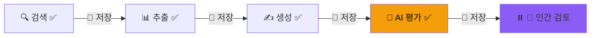
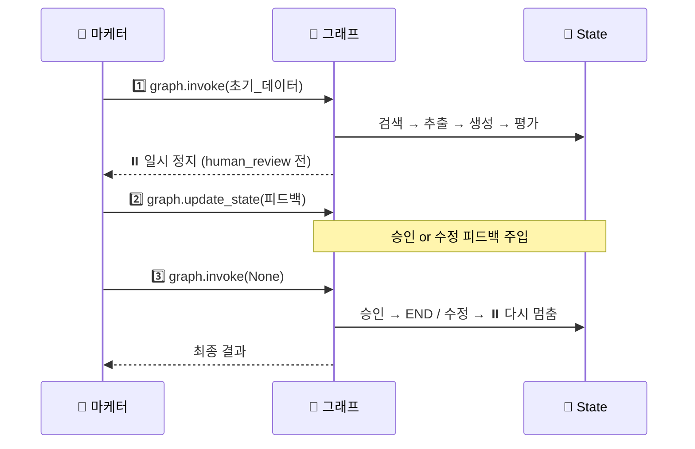
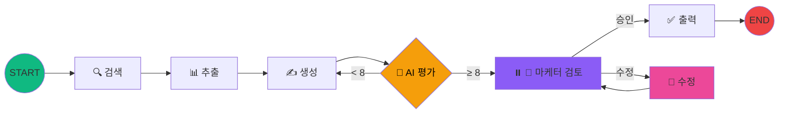
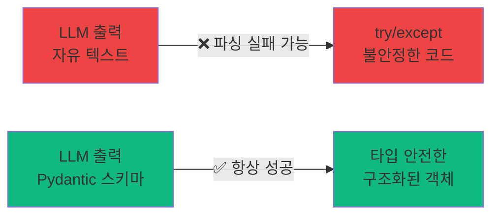

# 4교시
## Human-in-the-loop (HITL)<br>트렌드 카피 최종 승인 및 피드백

⏱️ 55분 · ⭐⭐⭐ 중간 난이도

<!-- 4교시 시작. 에이전트가 만든 카피를 실무에 안전하게 적용하기 위해, 인간의 개입을 허용하는 기능을 배웁니다. -->

---

# 학습 목표

<br>

### 이 시간이 끝나면 여러분은...

<br>

1. 💾 **체크포인터(Checkpointer)** 의 원리를 이해합니다
2. ⏸️ 그래프를 특정 노드에서 **일시 정지**할 수 있습니다
3. 👤 인간의 **피드백을 주입**하고 그래프를 **재개**할 수 있습니다
4. 🔄 승인/수정 **반복 워크플로우**를 구현합니다

---

# 왜 Human-in-the-loop인가?

<div class="grid grid-cols-2 gap-8 mt-4">
<div>

### ❌ 완전 자동화의 위험

- AI가 부적절한 카피를 생성할 수 있음
- 브랜드 톤에 안 맞는 표현 사용 가능
- **법적 이슈**가 있는 표현 가능성
- 실무에서는 "검토 없이 집행"이 **불가능**

</div>
<div>

### ✅ HITL의 가치

- AI의 **창의성** + 인간의 **판단력** 결합
- 최종 의사결정은 **마케터**가!
- 브랜드 안전성 확보
- **점진적 신뢰** 구축 → 자동화 범위 확장

</div>
</div>

<br>

> 💡 HITL = AI를 대체가 아닌 **"협업 파트너"** 로 만드는 핵심 패턴

---
layout: section
---

# 4-1. 체크포인터(Checkpointer) 도입

그래프 실행을 "세이브"하고 "일시 정지"하기

---

# Checkpointer란?

<div class="grid grid-cols-2 gap-8 mt-4">
<div>

### 🎮 게임의 세이브 포인트

- 각 노드 실행 후 **State 자동 저장**
- 실패해도 **처음부터 다시 X**
- 특정 지점에서 **일시 정지** 가능
- 나중에 **이어서 실행** 가능

</div>
<div>

### 코드 한 줄로 설정

```python
from langgraph.checkpoint.memory import MemorySaver

checkpointer = MemorySaver()
```

</div>
</div>

---

# Checkpointer 실행 흐름



> 💡 각 노드 실행 후 💾 자동 저장 → `human_review` 직전에 **⏸️ 일시 정지!**

---

# State 확장 + 인간 검토 노드

노트북 `code/session4.ipynb`의 **첫 셀**에 3교시의 코드를 그대로 사용합니다 (동일한 import + 초기화).

3교시에서 만든 `TrendCopyState`를 **상속**하여 HITL 필드를 추가합니다.

```python {1-4|6-16|all}
# State에 인간 피드백 필드 추가
class HITLCopyState(TrendCopyState):
    human_feedback: str     # 마케터의 피드백
    human_approved: bool    # 승인 여부

def human_review_node(state: HITLCopyState) -> dict:
    """이 노드 실행 직전에 그래프가 일시 정지됩니다"""
    print("\n" + "=" * 50)
    print("👤 마케터 검토 대기 중...")
    print("=" * 50)
    print(f"\n📝 검토 대상 카피:\n{state['ad_copy']}")
    print(f"\n📊 AI 품질 평가: {state['quality_score']}/10")
    print(f"💬 AI 피드백: {state['feedback']}")
    
    return {}  # ← 인간 피드백은 외부에서 주입!
```

---

# `interrupt_before`로 일시 정지

```python {1-4|6|all}
# 그래프 컴파일 시 interrupt_before 설정
graph = graph_builder.compile(
    checkpointer=checkpointer,
    interrupt_before=["human_review"]  # ← 이 노드 전에 멈춤!
)

# Thread ID를 사용한 실행 (같은 ID = 같은 세이브 슬롯!)
config = {"configurable": {"thread_id": "marketing-copy-review-1"}}
```

<br>

### 실행하면?

```python
result = graph.invoke(
    HITLCopyState(product_name="글로우핏 콜라겐 젤리", ...),
    config  # ← config 필수!
)

print("⏸️ 그래프가 일시 정지되었습니다!")
print("다음 실행할 노드:", graph.get_state(config).next)
# 출력: ('human_review',)
```

> 에이전트가 검색 → 추출 → 생성 → 평가까지 끝낸 뒤, **`human_review` 직전에 멈춤**!

---
layout: section
---

# 4-2. 인간 피드백 주입 및 그래프 재개

마케터의 판단을 에이전트에게 전달하기

---

# `update_state`로 피드백 주입

마케터가 **직접 입력**하여 에이전트에게 피드백 전달

```python
# 마케터 입력 받기
approved = input("승인하시겠습니까? (y/n): ")
feedback = input("피드백을 입력하세요: ")

# 피드백을 그래프에 주입
graph.update_state(
    config,
    values={
        "human_approved": approved.lower() == "y",
        "human_feedback": feedback
    },
    as_node="human_review"
)
```

> 💡 `as_node="human_review"` → **이 노드가 실행된 것처럼** State 업데이트. 그래프가 다음 단계로 진행할 수 있게 됩니다.

---

# 피드백 기반 분기 로직

```python
def route_after_review(state: HITLCopyState) -> str:
    """마케터 피드백에 따라 분기"""
    if state.get("human_approved", False):
        return "approved"
    else:
        return "revise"

def revise_copy_node(state: HITLCopyState) -> dict:
    """마케터 피드백을 반영하여 카피 수정"""
    prompt = f"""
    기존 광고 카피를 마케터의 피드백을 반영하여 수정해주세요.
    
    [기존 카피]
    {state['ad_copy']}
    
    [마케터 피드백]
    {state['human_feedback']}
    
    피드백을 정확히 반영하면서도 기존 카피의 장점은 유지해주세요.
    """
    response = llm.invoke(prompt)
    return {"ad_copy": response.content}
```

---

# 최종 출력 노드

```python
def final_output_node(state: HITLCopyState) -> dict:
    print("🎉 최종 승인된 광고 카피")
    print(f"\n{state['ad_copy']}")
    print(f"\n👤 마케터 코멘트: {state['human_feedback']}")
    return {}
```

> 💡 `route_after_review` → 승인이면 `final_output`, 수정이면 `revise_copy` → 다시 `human_review`로 루프

---

# 그래프 재개 (Resume)

```python
# None을 전달하면 → 새 입력이 아닌, 저장된 State에서 이어서 실행!
final_result = graph.invoke(None, config)
```

<br>

> 💡 `None`을 전달하면 새 데이터가 아닌, **체크포인터에 저장된 State**에서 이어서 실행됩니다.

---



---

# HITL 그래프 조립 (1/2) — 노드

노트북 `code/session4.ipynb` — 전체 코드를 조립합니다.

```python
graph_builder = StateGraph(HITLCopyState)

# 노드 추가
graph_builder.add_node("search_trends", search_trends_node)
graph_builder.add_node("extract_trends", extract_trends_node)
graph_builder.add_node("trend_copywriter", trend_copywriter_node)
graph_builder.add_node("quality_evaluator", quality_evaluator_node)
graph_builder.add_node("human_review", human_review_node)
graph_builder.add_node("revise_copy", revise_copy_node)
graph_builder.add_node("final_output", final_output_node)
```

---

# HITL 그래프 조립 (2/2) — 엣지 + 컴파일

```python
graph_builder.add_edge(START, "search_trends")
graph_builder.add_edge("search_trends", "extract_trends")
graph_builder.add_edge("extract_trends", "trend_copywriter")
graph_builder.add_edge("trend_copywriter", "quality_evaluator")

graph_builder.add_conditional_edges(
    "quality_evaluator", should_retry,
    {"pass": "human_review", "retry": "trend_copywriter"}
)
graph_builder.add_conditional_edges(
    "human_review", route_after_review,
    {"approved": "final_output", "revise": "revise_copy"}
)
graph_builder.add_edge("revise_copy", "human_review")
graph_builder.add_edge("final_output", END)

graph = graph_builder.compile(
    checkpointer=checkpointer,
    interrupt_before=["human_review"]
)
```

---

# 최종 아키텍처 🏗️



---

# 그래프 시각화 🔍

노트북에서 HITL 그래프의 전체 구조를 확인합니다.

```python
from IPython.display import Image, display

# HITL 그래프 시각화
display(Image(graph.get_graph().draw_mermaid_png()))
```

<br>

> 💡 `interrupt_before`로 설정한 **`human_review` 노드 앞에 멈추는 지점**과<br>
> 승인/수정에 따라 갈라지는 **조건부 분기**를 다이어그램에서 확인해보세요!

---

# 🏋️ 과제 1: 피드백 시나리오 체험

아래 3가지 시나리오로 `update_state`를 실행해보세요. 각 시나리오별 결과 차이를 비교!

1. ✅ **승인** — "좋습니다! 바로 집행합시다"
2. ✏️ **수정 요청** — "가격 혜택을 더 강조해주세요. '첫 구매 50% 할인'을 포함해주세요."
3. ✏️ **톤 변경** — "좀 더 격식체로 바꿔주세요. 비즈니스 의사결정자가 타겟입니다."

- 샘플 코드: `code/session4.py` 하단 참고

---

# 🏋️ 과제 2: 수정 노드 커스터마이징

`revise_copy_node`의 프롬프트에 **헤드라인 유지 + 변경사항 요약** 조건을 추가해보세요.

- 기존 카피의 **헤드라인은 반드시 유지**할 것
- 수정 시 마지막에 **[변경 사항 요약]** 을 추가할 것
- `revise_copy` → `quality_evaluator` → `human_review`로 이어지는 **자동 재평가 루프**도 도전!
- 샘플 코드: `code/session4.py` 하단 참고

---

# 🏋️ 도전 과제

<div class="p-3 rounded bg-yellow-500 bg-opacity-10">

`interrupt_before` 대신 `interrupt_after`를 사용하면 어떤 차이가 있을까요?

직접 바꿔서 실행 흐름의 변화를 관찰해보세요!

> 💡 **힌트**: `interrupt_before`는 노드 실행 **전에** 멈추고, `interrupt_after`는 노드 실행 **후에** 멈춥니다. `human_review_node`의 `print` 출력 타이밍이 달라집니다.

</div>

---
layout: section
---

# 4-3. 에이전트 신뢰도 확보

LLM 출력의 일관성을 높이는 3가지 기법

---

# 문제: LLM 출력은 예측 불가능

### ❌ 지금까지의 문제

```
"점수: 8점"
"점수: 8/10"
"점수: 약 8점 정도"
"8"
```

- **같은 요청**인데 **다른 형식**으로 답변
- `split()`, `filter()` 파싱이 실패할 수 있음
- 프로덕션에서는 **치명적**

---

# 해결책: 구조화된 출력



```python
{
    "score": 8,
    "feedback": "트렌드 반영도 높음"
}
```

- LLM에게 **정해진 스키마**로 답하도록 강제 → 파싱 실패 **원천 차단**

---

# ① Structured Output: 구조화된 출력

`with_structured_output()`로 LLM이 **정해진 스키마**로만 응답하게 만듭니다.

```python
from pydantic import BaseModel, Field

class QualityEvaluation(BaseModel):
    """광고 카피 품질 평가 결과"""
    score: int = Field(description="품질 점수 (1-10)")
    feedback: str = Field(description="구체적인 개선 방향")

# LLM에게 이 스키마로 답하도록 강제
structured_llm = llm.with_structured_output(QualityEvaluation)

result = structured_llm.invoke("계열 카피를 평가해줘")
print(result.score)     # 8  (항상 int!)
print(result.feedback)  # "트렌드 반영도..." (항상 str!)
```

> 💡 `with_structured_output()`는 LLM이 **Pydantic 모델 형태**로만 응답하도록 강제합니다. 파싱 실패가 **불가능**!

---

# ② Pydantic State 검증

State를 `TypedDict` 대신 **Pydantic 모델**로 정의하면, 값이 **자동 검증**됩니다.

```python
from pydantic import BaseModel, Field, field_validator

class ValidatedCopyState(BaseModel):
    product_name: str
    target_audience: str
    quality_score: int = Field(default=0, ge=0, le=10)  # 0~10 강제!
    iteration_count: int = Field(default=0, ge=0, le=5)  # 최대 5회
    ad_copy: str = ""

    @field_validator("product_name")
    @classmethod
    def name_not_empty(cls, v):
        if not v.strip():
            raise ValueError("제품명은 비어있을 수 없습니다")
        return v
```

<div class="mt-4 p-3 rounded bg-blue-500 bg-opacity-10 text-sm">

💡 `quality_score`에 11을 넣으면? → **자동으로 `ValidationError`** 발생! 잘못된 값이 State에 들어가는 것을 방지합니다.

</div>

---

# ③ 개선된 품질 평가 노드

`with_structured_output`을 적용하면, 기존 `try/except` 파싱 코드가 **완전히 사라집니다**.

```python
def quality_evaluator_node_v2(state) -> dict:
    structured_llm = llm.with_structured_output(QualityEvaluation)
    
    result = structured_llm.invoke(f"""
        아래 광고 카피의 품질을 평가해주세요.
        
        [광고 카피]
        {state['ad_copy']}
        
        평가 기준: 타깃 적합성, 트렌드 반영도, 클릭 유도력
    """)
    
    # 파싱 코드 없음! result.score는 항상 int
    print(f"🎯 품질 점수: {result.score}/10")
    
    return {
        "quality_score": result.score,
        "feedback": result.feedback,
        "iteration_count": state.get("iteration_count", 0) + 1
    }
```

> 💡 3교시의 10줄짜리 파싱 코드가 → **0줄**로! 더 안전하고 더 깔끔하게.

---
layout: section
---

# 4-4. Wrap-up

오늘 배운 것 총정리 & 실무 도입 아이디어

---

# 오늘 배운 핵심 개념 총정리

| 교시 | 핵심 개념 | 마케팅 적용 포인트 |
|:---:|---------|-----------------|
| **1교시** | State, Node, Edge | 마케팅 워크플로우의 **구조화** |
| **2교시** | 단일 노드 그래프 | LLM 기반 **카피 자동 생성** |
| **3교시** | Tool + Conditional Edge | 외부 데이터 활용 + **자율 개선 루프** |
| **4교시** | Checkpointer + HITL | **안전한 실무 적용** (인간 승인) |

<br>

<div class="text-center p-4 rounded bg-gradient-to-r from-blue-500/10 to-purple-500/10">

### 💡 핵심 메시지

**LangGraph** = **AI의 창의성** + **인간의 판단력**을 결합하는 프레임워크

</div>

---

# 실무 도입 시 고려사항 ⚠️

<div class="mt-4 p-3 rounded bg-yellow-500 bg-opacity-10">

⚠️ **한계점 인지**: 프롬프트 의존성(개선 필요), API 비용(토큰 사용량), 응답 시간(복잡한 그래프일수록 느림). 실무 도입 시 고려하세요.

</div>

---

# 🚀 보너스: FastAPI로 에이전트 배포하기

LangGraph 에이전트를 **REST API**로 감싸면 어디서든 호출할 수 있습니다.

```python
from fastapi import FastAPI
from pydantic import BaseModel

app = FastAPI(title="카피 생성 에이전트 API")

class CopyRequest(BaseModel):
    product_name: str
    target_audience: str
    tone: str = "트렌디하고 감각적인"
    usp: str

@app.post("/generate")
async def generate_copy(request: CopyRequest):
    result = graph.invoke({...})  # 2교시 그래프 호출
    return {"ad_copy": result["ad_copy"]}
```

> 💡 `graph.invoke()`를 엔드포인트로 감싸기만 하면 끝!

---

# 🏋️ 보너스 과제: API 서버 실행

터미널에서 아래 명령어를 실행해보세요.

```bash
uv add fastapi
uv run fastapi dev code/server.py
```

<br>

브라우저에서 **http://localhost:8000/docs** 를 열면 Swagger UI가 나타납니다.

- `POST /generate` 엔드포인트에서 **제품 정보를 입력**하고 실행!
- 전체 코드: `code/server.py` 참고

---

# 에이전트 신뢰도: Temperature 제어 🌡️

LLM의 **창의성 vs 일관성**을 노드별로 조절할 수 있습니다.

| 노드 | Temperature | 이유 |
|------|:-----------:|------|
| 트렌드 추출 | 0.0~0.3 | 정확한 분석 필요 |
| 카피 생성 | 0.7~0.9 | 창의성 필요 |
| 품질 평가 | 0.0~0.2 | 일관된 판단 필요 |
| 카피 수정 | 0.5~0.7 | 피드백 반영 + 약간의 창의성 |

```python
# 노드별로 다른 LLM 인스턴스 사용
llm_creative = ChatGoogleGenerativeAI(model="gemini-2.5-flash", temperature=0.8)
llm_precise = ChatGoogleGenerativeAI(model="gemini-2.5-flash", temperature=0.1)
```

---

# 에이전트 모니터링: LangSmith 트레이싱 🔭

<div class="grid grid-cols-2 gap-8 mt-4">
<div>

### LangSmith를 쓰면?

- 모든 노드의 **입력/출력**이 자동 기록
- 각 노드의 **실행 시간, 토큰 사용량** 추적
- 실패 시 **어떤 입력으로 어떤 노드에서** 문제인지 즉시 파악
- 프롬프트 버전별 **A/B 테스트** 가능

</div>
<div>

### 설정방법 (환경변수 2줄)

```bash
# .env에 추가
LANGCHAIN_TRACING_V2=true
LANGCHAIN_API_KEY=발급받은_키
```

이것만으로 **모든 노드 실행이 자동으로 기록**됩니다!

<br>

> 📊 https://smith.langchain.com/

</div>
</div>

---

# 점진적 자동화 전략 📈

HITL의 **검토 범위를 점진적으로 줄여가는** 전략입니다.

```
1단계: 모든 카피를 인간이 검토        (신뢰 구축)
  ↓
2단계: 점수 8점 이상만 자동 승인        (부분 자동화)
  ↓
3단계: 점수 6점 이상만 자동 승인        (자동화 확대)
  ↓
4단계: 전체 자동, 예외 케이스만 검토    (거의 완전 자동)
```

<div class="mt-4 p-3 rounded bg-purple-500 bg-opacity-10 text-sm">

💡 **핵심**: 처음부터 완전 자동화하지 마세요. **데이터와 신뢰가 쌓이면** 자연스럽게 자동화 범위가 넓어집니다.

</div>

---

# 실무 도입 아이디어 💼

<div class="grid grid-cols-2 gap-6 mt-4">
<div>

### 🔍 경쟁사 모니터링 에이전트
경쟁사 광고 크롤링 → 전략 분석<br>→ 차별화 카피 제안

### 📊 A/B 테스트 에이전트
카피 변형 자동 생성 → 성과 예측<br>→ 최적안 추천

### 📧 CRM 자동화 에이전트
고객 세그먼트별 맞춤 메시지<br>자동 생성 및 발송

</div>
<div>

### 📱 멀티 채널 에이전트
핵심 메시지 → 채널별 최적화<br>(Meta/Google/카카오) 자동 변환

### 📈 리포팅 에이전트
광고 성과 데이터 수집<br>→ 인사이트 추출 → 개선안 제안

### 🎯 키워드 에이전트
검색광고 키워드 자동 확장<br>→ 입찰가 추천 → 성과 모니터링

</div>
</div>

---

# 다음 단계 🚀

<div class="grid grid-cols-2 gap-8 mt-4">
<div>

### 📚 심화 학습 리소스

- **LangGraph 공식 문서**<br>https://langchain-ai.github.io/langgraph/
- **LangGraph Studio** (시각적 IDE)<br>https://studio.langchain.com/
- **LangSmith** (디버깅/모니터링)<br>https://smith.langchain.com/
- **Multi-Agent 패턴**<br>Supervisor / Swarm 구조

</div>
<div>

### 🛠️ 추천 프로젝트

1. **Slack/카카오톡 연동**<br>오늘 만든 에이전트에<br>메신저 알림 추가

2. **광고 성과 분석**<br>CSV 데이터를 읽어<br>자동 분석하는 노드 추가

3. **Multi-Agent 확장**<br>카피라이터 + 디자이너 + PM<br>에이전트 협업 구조

</div>
</div>

---
layout: center
class: text-center
---

# 감사합니다! 🎉

<br>

### 오늘 함께 만든 것

**단순 카피 생성** → **트렌드 반영 + 자율 개선** → **인간 협업 워크플로우**

<br>

LangGraph로 여러분의 마케팅 워크플로우를 혁신해보세요!

<br>

<div class="text-sm opacity-70">

Q&A 시간

</div>

<style>
h1 {
  background: linear-gradient(135deg, #667eea 0%, #764ba2 100%);
  -webkit-background-clip: text;
  -webkit-text-fill-color: transparent;
}
</style>
